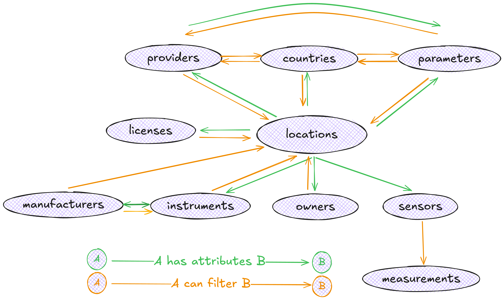
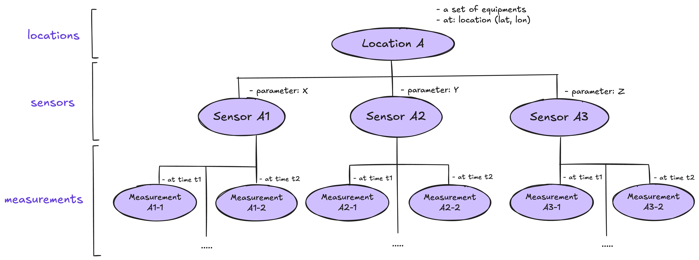

## Today's agenda (session I)
- Ice-breaking activity (10 mins)
- Overview of the OpenAQ Python SDK (10 mins)
- Setting up the notebook on your computer (10 mins)
- OpenAQ Python SDK tutorials part I: Intro to key resources (20 mins)
- Q&As (10 mins)

# Ice-breaking
(using your phone is recommended for this activity!)

---

## About the Python SDK
- Part of our core tech products
- Allows you to connect to our API and programmatically access air quality data hosted on OpenAQ platform
- Latest version: **1.0.3**

---

## Why use the Python SDK?
- Accessing air quality data in bulk, from any location and any time
- User-friendly helpers: expressive error handling, preemptive error catching, automatic rate limiting
- More intuitive data access: Python objects-oriented instead of API json responses
- Fully typed: autocomplete, inline documentation

---

## Data models {.smaller}
{width="880px" height="500px"}

For a full definition of each resource, visit our [Python documentation website](https://python.openaq.org/).


## Data models {.smaller}
{width="880px" height="500px"}

For a full definition of each resource, visit our [Python documentation website](https://openaq.github.io/openaq-python/).


## Data models {.smaller}
{width="2000px" height="480px"}

Every Location and Sensor instance gets a unique ID.

# Key concepts

## API key

The OpenAQ API uses API keys to authenticate requests and manage access. 

- control usage and enforce rate limits
- unique and can be requested anew to each users.

::: {.callout-important}
Do not share your API key with anyone.
:::

## Rate limiting {.smaller}
Our API limits users' usage at:

- 60 requests/minute
- 2,000 requests/hour

::: {.callout-note}
From v1.0.0rc1, our Python package supports automatic rate limiting.
:::

## Pagination {.smaller}

- By default, a request will return a maximum of 100 results a page. This is adjustable and can be set up to 1,000 results per page using `limit=1000`. 

- If a request returns more than 1,000 results, you can loop through the pages until no more data is found.

::: {.callout-tip}
Querying the entire dataset and paging can be slow. Adding constraints will help your requests be more performative, especially for volume-intensive resources like Measurements.
:::

``` {python}
{
    "meta": {
        "name": "openaq-api",
        "website": "/",
        "page": 1,
        "limit": 1000,
        "found": ">1000"
    }
}
```

# Tutorials

---

## Overview {.smaller}

The tutorial is exercises-driven and works as a primer to OpenAQ Python SDK. Having the code run on your machine as we go is encouraged but optional.

<br>

#### If you want to run the code on your computer as you follow along, by now you should have:

- A [molab account](https://molab.marimo.io)
- Your own [OpenAQ API key](https://explore.openaq.org/register)

## Let's start {.smaller}

**Step 1:** Go to [this link](https://molab.marimo.io/notebooks/nb_XGx4FKHVwT8EgnDFeJh9mD) to create a notebook session for this tutorials

**Step 2:** Once you're in the link:

- Click “Fork” at the top of the page. You will be prompted to log in to your molab account if you’re currently logged out.
- Once you have logged in, you will be automatically redirected to your own forked version of the notebook on the web.
- The notebook is yours to play with and will also be accessible to you via your molab homepage.

---

## Useful links
- [OpenAQ Python SDK documentation](https://openaq.github.io/openaq-python/)
- [OpenAQ API documentation](https://docs.openaq.org/)
- [OpenAQ Explorer](https://explore.openaq.org/#1.2/20/40)
- Join [OpenAQ slack channel](https://openaq.slack.com/join/shared_invite/zt-3ga21nbn9-GIFP2NfNTdS0I9OMuKUEbw#/shared-invite/email) for questions and discussions anything air quality

